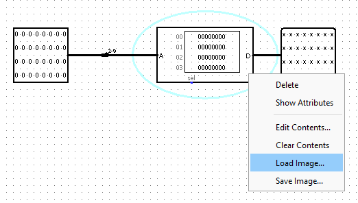

# 📟 32 bits CPU design

  

## Summary
1. [Overview](#overview)
2. [Try it!](#try-it)
3. [Improvements](#improvements)
4. [Credits](#credits)

## Overview
The CPU implements a simple [Harvard architecture](https://en.wikipedia.org/wiki/Harvard_architecture). It is the opportuinity to deep dive in the world of computation structures. The result is a fully capable mono core cpu running beta assembly.
The control logic content is generated using a custom python script. To generate the ROM image of the control logic, one can simply run `python ./circuit/control_logic.py`, the image will be output to `./circuit/controlLogic.txt`.

### Characteristics
- Harvard architecture
- 32 bits registers
- 32 bits data unit storage
- Beta assembly compliant

This project was done for the INFO0012 (Computation structures) course.
Note : No copying (even partial) of this code within the scope of the INFO0012 course will be tolerated.

## Try it!

1. Create your own beta assembly program (or use the example `asm/fact.asm`) and assemble it using `asm/bsim-logisimexport.jar`
    - Run `java -jar ./asm/bsim-logisimexport.jar fileName` where fileName is the name of the assembly file to assemble.
    - Click the `RUN AMS` button in the top menu to test your program in simulation.
    - Click the `USAM to logisim ROM image` button in the top menu to generate the machine code.
2. Load your program in the instruction memory
    - Run `java -jar ./circuit/logisim-generic-2.7.1.jar ./circuit/cpu.circ`.
    - Double click on the Instruction memory.
    
    - Right click on the ROM > Load image > select your .logisim_content file.
    
    - Run the simulation, in the top menu click on `Simulate`, reset the simulation, enable the simulation and chose a clock frequency from the menu.
    - Check the result in the Regiler File / Data memory

## Improvements
- The CPU does not implement the 32 availables registers, only registers 0-4, 29, 30 and 31. 
- The CPU does not implements all the functionnalities availables in `asm/beta.uasm`, e.g., BP pointer
- The CPU does not implement any form of interrupts management.

## Credits
- [Simon Gardier](https://github.com/simon-gardier)
- [Logisim](http://www.cburch.com/logisim/)
- [BSim](https://github.com/terman/6.004_courseware/tree/master)
